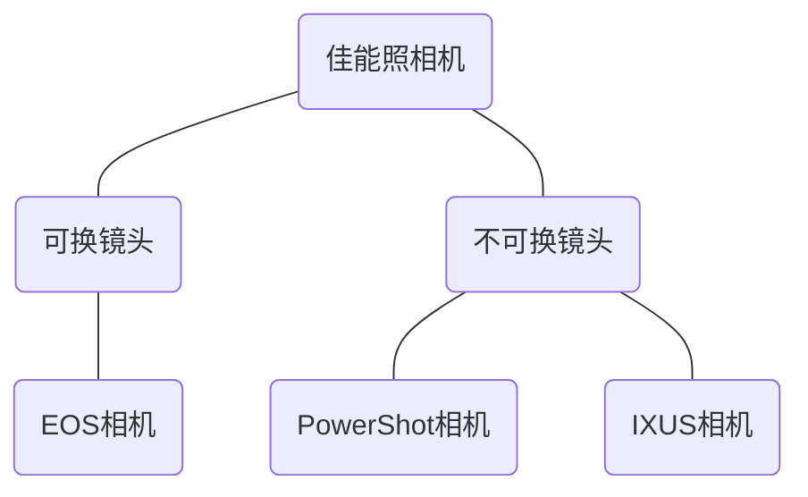

### 一. 佳能旗下三大品牌

佳能共三种相机品牌，分别是EOS、PowerShot和IXUS。

其中EOS为可换镜头相机，包括单反和微单。PowerShot和IXUS为不可换镜头相机，即固定镜头相机。佳能官方称之为“小型数码相机”，一般将其俗称为[卡片机](./相机总论（概论）.md#6.%20卡片相机)。<!--%20代表空格 -->

```mermaid
graph TB
A(佳能照相机)
A---B(可换镜头)
B---B1(EOS相机)
A---C(不可换镜头)
C---C1(PowerShot相机)
C---C2(IXUS相机)
```