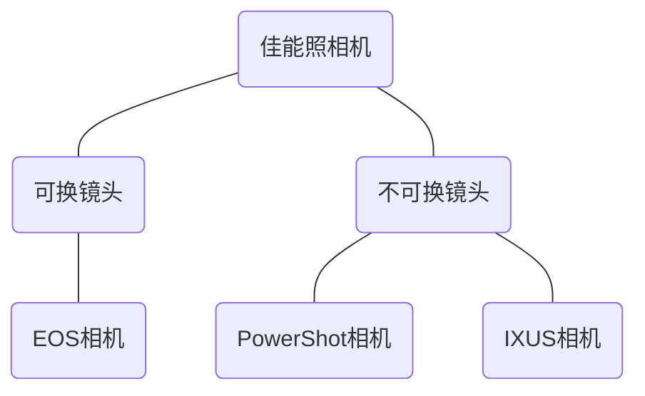
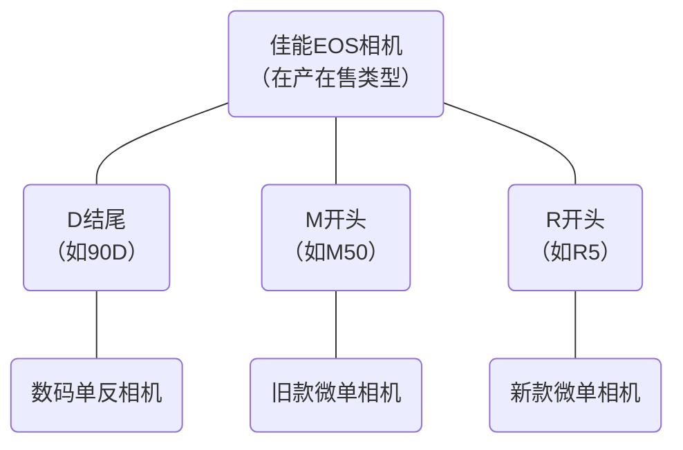

### 一. 佳能旗下三大品牌

佳能共三种相机品牌，分别是EOS、PowerShot和IXUS。

其中EOS为可换镜头相机，包括单反和微单。PowerShot和IXUS为不可换镜头相机，即固定镜头相机。佳能官方称之为“小型数码相机”，一般将其俗称为[卡片机](./相机总论（概论）.md#6.%20卡片相机)。<!--%20代表空格 -->

### 二. 佳能EOS相机

目前所有EOS相机均为可换镜头的数码相机，并分为D、M、R三个系列。

D系列是数码单反相机，佳能的单反有辉煌经典的历史，但如今单反已逐渐被微单取代，基本上很少有新款的单反产品。

M系列是旧款微单相机，从2012年开启，主打小巧便携、便宜易用，但由于佳能推出了潜力更好的R微单系列产品，M系列基本也已经完结。

R系列是佳能的新款微单相机，从2018年开启，是目前佳能的研发生产重心。

##### 1. 佳能数码单反（以字母D结尾）

从2003年开始，佳能所有数码单反产品以**数字加字母D方式**命名，D前面的数字位数越少，型号越高级，例如：
- 全画幅和旗舰APS-C画幅单反：5D Mark IV
- 高端APS-C画幅单反：90D
- 中端APS-C画幅单反：850D
- 低端APS-C画幅单反：1500D

全画幅和旗舰APS-C画幅单反只有4大类，格式为"xD Mark x"，如5D Mark IV。
- 1D X系列：旗舰全画幅相机（高速相机）
- 5D系列：高端全画幅相机
- 6D系列：入门全画幅相机
- 7D系列：旗舰APS-C画幅相机（高速相机）

Mark后是相机代数，用罗马数字标注。注意该代数只在同系列内比较有效。如 5D Mark IV 比 5D Mark III 更新，但 6D Mark II 比 5D Mark IV 更新。

除了全画幅和旗舰APS-C画幅单反之外，高中低端APS-C画幅单反的命名就是数字加字母D结束。

###### xxxxD系列：低端APS-C画幅数码单反
价格便宜，采用濒临淘汰的元件和严重过失的技术，各方面表现极差，目前全部停产停售。

###### xxxD系列：中端APS-C画幅数码单反
三位数xxxD系列分为中端的大三位数系列和中低端的小三位数系列，大三位数系列从300D到850D，小三位数系列从100D到250D（为了避讳250这个数字，国内改名为200D II）。

三位数系列适合钱少又想体验单反的业余爱好者。配置较为完善。大三位数在小三位数的基础上提升了对焦和连拍性能。

###### xxD系列：高端APS-C画幅数码单反
佳能的高端APS-C单反系列，从10D到90D，属于佳能最知名最畅销的单反系列。没有意料之外的黑科技，也没有明显短板，适合广大业余爱好者。

最新一代90D是佳能万元内最强的单反型号。

###### xD系列：全画幅单反及旗舰APS-C画幅单反
1D X系列和7D系列都属于高速相机，适合拍摄动态场景，不适用于拍人像和静物。

5D系列是佳能高端全画幅单反系列，最新的5D Mark IV代表了佳能单反的最好画质。曾经还有5DS这条副线，有两款主打高像素的相机，但均已停产。6D系列相比5D较为低端一些，最新一代是6D Mark II。但由于目前微单盛行，相比而言性价比不再是优势。

##### 2. 佳能R系列微单（以字母R开头）
2018年，微单技术的进步与成熟使得高端微单市场日趋繁荣，而单反的生存空间再被挤压，于是佳能决定开启R微单系列。

目前的佳能R微单系列大多为字母R加一个数字，数字越小定位越高端。目前的系列包括：
- R3：旗舰全画幅机型
- R5：高端全画幅机型
- R6：中端全画幅机型
- R7：旗舰APS-C画幅机型
- R8：入门级全画幅机型
- R10：中端APS-C画幅机型
- R50：入门级APS-C画幅机型

###### R3系列
R3系列具有佳能最强的连拍性能，适合体育摄影、生态摄影和新闻摄影，画质与视频也相当优秀，是目前佳能最高端最昂贵的微单相机。定位近似1D X系列单反，对标索尼A9系列。机身定价37000元。

###### R5系列
R5系列为高端全画幅机型，接替单反5D系列的位置，对标索尼A7R系列与尼康Z7系列。主打画质与像素，是佳能微单中画质最好的相机。但长时间高规格录像后容易过热停机。机身定价26000元。

此外佳能还推出了R5 C，但这并不是R5系列的升级迭代，而是属于主打视频拍摄的电影摄像机，主要是用于专业人士打造的专业视频相机，不适合作为拍照主力机和新手入门机。

###### R6系列
R6系列是中端全画幅机型，对标索尼A7系列和尼康Z6系列，采用R5同款处理器，在画质、像素、视频和做工上相比较R5有阉割，机身定价18000元。

###### R7系列
R7系列是佳能目前最高端的APS-C画幅微单，像素好、对焦好、防抖长、续航强，配置上完胜佳能同档位的90D和M6 Mark II，但定价已经接近全画幅相机，性价比不高。机身定价12000元。

###### R8系列
R8系列是2023年2月发布的入门级全画幅微单，配置与R6系列第二代R6 Mark II高度相似，只是阉割了机身防抖。定价12000元。

##### R10系列
R10系列发布于2022年5月，属于中端APS-C画幅微单，相比R7系列舍弃了高像素传感器和机身防抖，阉割了连拍速度、电池续航、取景器像素和耐候性，换取了更低的价格和更好的便携性。套机定价8299元。

###### R50系列
R50系列发布于2023年2月，是佳能R微单中最便宜的产品，相比R10主要在连拍、视频等方面有所牺牲，对卡槽、热靴等部件有阉割，但相对而言有一定性价比，定价6000元。

