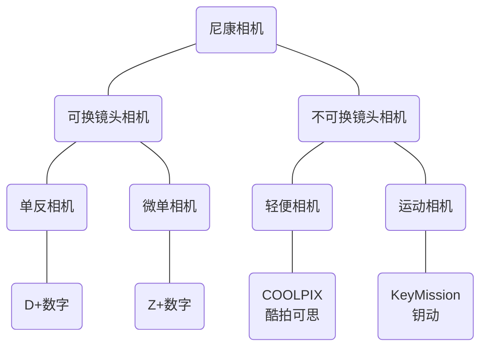

尼康相机总体特点参考[尼康Nikon](./相机总论（概论）.md#2.%20尼康Nikon)。

### 一. 尼康相机的四个系列

尼康相机大致可以分为四个系列：
- D开头的单反相机系列
- Z开头的微单相机系列
- COOLPIX开头的固定镜头相机系列
- KeyMission开头的运动相机系列

其中前两个系列是可换镜头相机，后两个系列是固定镜头相机。

### 二. 传统老牌：D系列单反相机

自1999年以来，尼康所有单反相机的型号都以"字母D+数字"的方式命名。

**注：尼康单反是字母D在前，数字在后，如D850，佳能单反是数字在前，字母D在后，如850D。**

尼康单反类似于其他几种相机主流品牌，同样是数字越短，型号定位越高级。对于数字长度相同的尼康单反型号，开头数字越大则定位越高端。第二个数字则反应了同类型内的新旧关系。

尼康在产单反有以下产品线（x代表一位数字）：

- 全画幅速度旗舰：Dx 如D6
- 全画幅画质旗舰：D8x0 如D850
- 全画幅入门：D6x0/D7x0 如D780
- APS-C速度旗舰：Dx00 如D500
- APS-C高端：D7x00 如D7500
- APS-C中端：D5x00 如D5600
- APS-C低端：D3x00 如D3500

##### 1. 全画幅单反相机
Dx系列是尼康的全画幅速度旗舰，代表尼康单反的最强对焦与连拍性能，对标佳能的1D系列和索尼的A9系列。最新款为D6，是单反相机中光学对焦性能最强的产品，主要适用于体育摄影师拍摄。

D8x0是尼康第二昂贵的单反系列，代表尼康单反的最强画质，对标佳能5D系列。最新款是D850，被评为市面上最好的单反相机，画质极佳。定价19000元。

D6x0/D7x0是尼康的全画幅入门机型，对标佳能的6D系列，这两个不同的开头数字实际上代表同一条生产线，原因是D600因设计缺陷造成了负面影响，为了重建市场信任，发布新款全画幅入门单反时取名为D750以示和D600撇清关系。

##### 2. APS-C单反相机
