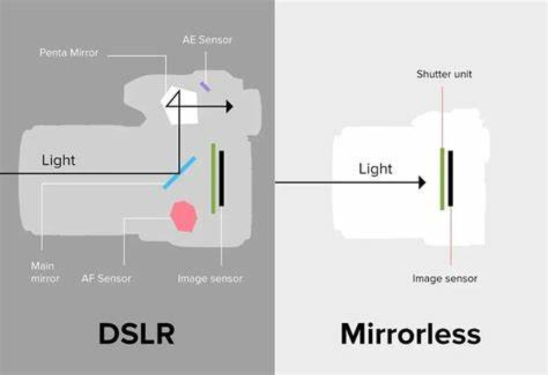

### 一. 相机分类
主流相机包括<u><mark>**单反相机、无反相机、旁轴相机、双反相机、运动相机、卡片相机和全景相机**</mark></u>共7类。

##### 1. 单反相机
单镜头反光照相机。最常见的相机类型，**只有一个镜头并且带有一个反光板的相机**。光线通过镜头进入相机内部，由快门前的反光板将光线反射到相机顶部内置的五棱镜，经过两次反射最后从取景器射出从而进入人眼。当按下快门时，反光板迅速抬升失去反光作用（所以快门开启期间光学取景器里看到的是纯黑色，光线直接由镜头进入感光元件从而成像。

***<u>注：即反光板的作用是</u>***
- 将光线反射入人眼
- 阻断光线进入感光元件

而按下快门的实际作用是解除反光板对光线进入感光元件的阻断，因此快门速度越快进光量越少。

由设计结构可以看出其装置多且复杂，因此带来了单反相机庞大且厚重的形态。但由于大量装置驱动为机械式（不使用屏幕显示），所以单反具有更好的续航能力且能应对更多的极端环境，稳定可靠。

***<u>注：此处机械式的含义是，不依赖于电子屏幕硬件（光学取景框是光学机械式，没电也能用），因此可以有更好的续航力和适应力，但问题是不能做到所见即所得（如快门速度带来的影响不能通过光学取景框实时显示）。</u>***

***<u>优势：  1. 单反相机发展时间长，有更多的镜头可以选择，微单可选择镜头的余地比单反少   2. 单反相机有光学取景器和电子取景器两种模式，光学取景器模式的续航时间长   3. 单反相机光学取景器模式，由于画面直入人眼，取景体验好（不代表拍摄出的质量更高）</u>***

如：Canon 5D Mark Ⅳ、Nikon D810
###### 单反微单对比图（体型）

###### 单反微单对比图（内部）

##### 2. 无反相机（微单相机）
没有反光板的相机，重量轻，体积小。**通常拆下镜头后可以直接看到快门或感光元件**。由于没有反光板的设计，所以自然没有光学取景器，取而代之的是电子取景器（取景器内部是一块小电子屏幕），光线直接通过镜头进入感光元件成像。电子取景器的优势是所见即所得，当你调整相机参数的时候在电子取景器中可以实时看到前后的变化，这一点是光学取景器做不到的（毕竟它只是一块玻璃）。

但电子取景器的能耗较大，这也造成了无反相机的续航能力远不如单反相机，虽然现阶段来说无反相机的技术已经相对成熟，从作品质量上基本看不出任何区别，但因为无反相机的结构设计，也注定了它不能应对太多的复杂环境。

***<u>注：参考对比单反的特点。</u>***

***<u>优势：  1. 微单相机电子取景器，参数变化直接反映在取景器上，相比单反光学取景更易用   2. 相比单反相机，微单相机更适合拍视频   3. 体积、重量、便携式上微单优势较大   4. 各厂家主推微单，单反目前业务量少，都是老机型</u>***

如： Sony A6400、Canon EOS R

##### 3. 旁轴相机
待补充

##### 4. 双反相机
待补充

##### 5. 运动相机
待补充

##### 6. 卡片相机
待补充

##### 7. 全景相机
待补充

### 二. 相机品牌
主流相机品牌包括<u><mark>**佳能Canon、尼康Nikon、索尼Sony、富士FUJIFILM、徕卡Leica**</mark></u>等等。